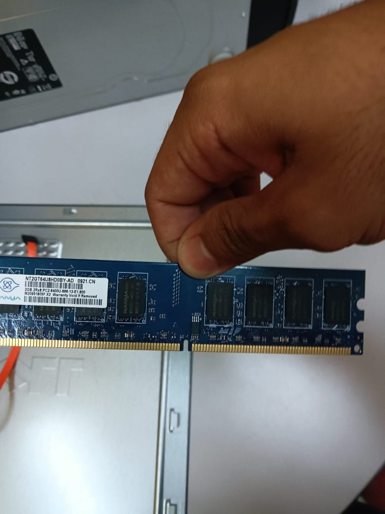
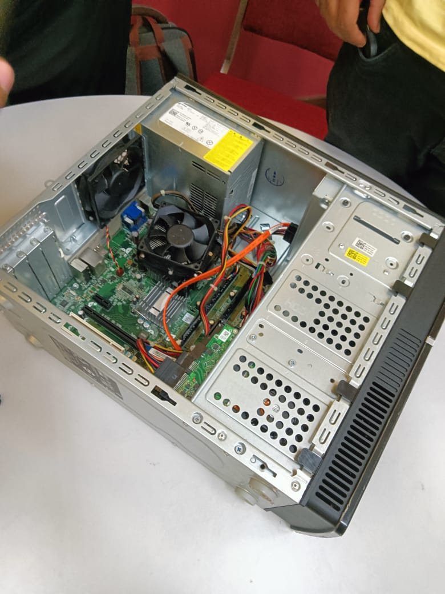
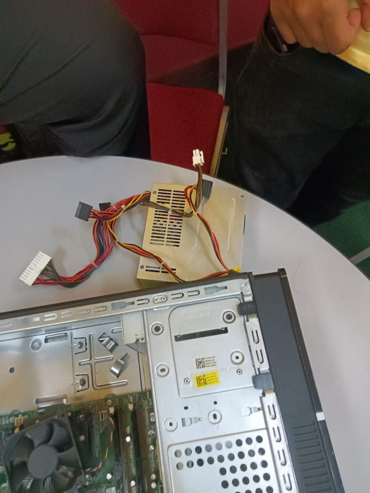

# Technology and Information Systems (SECP1513) - e-Portfolio

**Name:** Ali Isameldin Ali Abdelrehman  
**Metric ID:** A23CS3001  
**Section:** 08
**Lecturer:** Dr. SHAFAATUNNUR BINTI HASAN  

---

## 1. Industry Talks & Visits

### Assignment 1: UTM Digital Open Day (Video Blog)
**Group:** Group 6  
**Description:** A video blog exploring the UTM Digital Open Day, featuring booths like Microsoft Copilot and interviews with industry professionals.
**Evidence:**  
[🎥 **Click Here to Watch Our Video Log**]([https://youtu.be/PdJnLjKOYQI?si=hitK5PwhrlJQrfpC]

### Assignment 2: Data Analytics & Infrastructure (PPG)
**Topic:** Insights from PPG Malaysia Technology Center  
**Output:** [View Assignment 2 Poster](Assignment2_Poster.jpg)

### Assignment 3: Project Management (Serunai Commerce)
**Topic:** System Development & Project Management  
**Output:** [View Assignment 3 Report](Assignment3_Report.pdf)

### Reflection on Industry Exposures
*   **What I gained:**  
    I gained a comprehensive view of the IT industry. **Assignment 1** showed me the latest consumer technologies (like Copilot). **Assignment 2** (PPG) highlighted the scale of global infrastructure (SAP). **Assignment 3** (Serunai) emphasized that soft skills and project management are just as critical as coding.
*   **My Opinion:**  
    These exposures bridged the gap between academic theory and industrial reality.

---

## 2. Lab Activity: PC Assembly
**Activity:** Hands-on training with PC Hardware Components

### Evidence of Work

  
   
  

### Reflection
*   **What I gained:**  
    This lab provided hands-on experience in assembling key components like the CPU, motherboard, and RAM. I learned the importance of safety precautions (grounding) and how hardware architecture influences system performance.

---

## 3. Design Thinking Project (SpaceSync)
**Project Title:** SpaceSync: Real-Time Campus Study Spot & Facility Manager
**Group:** Group 6
**Status:** ✅ Completed

### Project Overview
**SpaceSync** is a digital campus system designed to help students find available study spots in real-time. By using IoT sensor concepts and a user-friendly app interface, it aims to reduce the anxiety and wasted time students face when looking for empty tables in the library or labs.

**Output:** [View Final Project Report](SECP1513_%20Technology%20and%20Information%20Project%20.pdf)

### Reflection
*   **My Role:**
    As the team leader, I coordinated the project workflow, ensuring alignment between sections (Empathy, Define, Ideate, Prototype, Test). I was specifically responsible for the Introduction, Problem Statement, and Solution analysis.
*   **What I gained:**
    Through the SpaceSync project, I learned how Design Thinking transforms abstract problems into user-centered solutions by focusing on empathy, clarity, and practicality. Leading the team strengthened my communication and decision-making skills.
*   **My Opinion:**
    This project reinforced my interest in smart system design. It showed me that technical solutions (like sensors) are useless without understanding the human need (reducing anxiety and saving time).
